<p align="center">
  <h1 align="center">AAS AI Editor</h1>
  <p align="center">
    <strong>AI-Powered Editor for Industry 4.0 Digital Twins</strong>
  </p>
</p>

<p align="center">
  <a href="https://github.com/hadijannat/aas-ai-editor/actions/workflows/ci.yml">
    
  </a>
  <a href="https://github.com/hadijannat/aas-ai-editor/blob/main/LICENSE">
    
  </a>
  <a href="https://www.npmjs.com/package/@aas-ai-editor/core">
    
  </a>
  <a href="https://www.npmjs.com/package/@aas-ai-editor/mcp-server">
    
  </a>
  
  
  
  
</p>

---

## Why AAS AI Editor?

Creating and maintaining **Asset Administration Shells (AAS)** is complex—they require strict adherence to metamodel constraints, semantic IDs, and IDTA template specifications. Manual editing is error-prone and time-consuming.

**AAS AI Editor** solves this by combining a visual editor with **Claude AI** through the Model Context Protocol (MCP):

- **🤖 AI-Assisted Editing** — Claude suggests edits, fills templates, and auto-corrects validation errors
- **✅ Human-in-the-Loop** — All AI changes require your explicit approval before applying
- **🔄 Self-Correcting Validation** — AI automatically fixes errors through iterative refinement
- **📋 IDTA Templates** — Built-in support for standardized submodel templates

---

## Install from npm

Use the packages standalone without cloning the repository:

### MCP Server (for Claude integration)

```bash
# Run directly with npx
npx @aas-ai-editor/mcp-server

# Or add to Claude Code
claude mcp add aas-editor npx @aas-ai-editor/mcp-server
```

### Core Library (for your own projects)

```bash
npm install @aas-ai-editor/core
```

```typescript
import { readAasx, writeAasx } from '@aas-ai-editor/core/aasx';
import { selectSubmodelBySemanticId } from '@aas-ai-editor/core/aas';

const { environment } = await readAasx(aasxBuffer);
const nameplate = selectSubmodelBySemanticId(environment, 'https://admin-shell.io/...');
```

See the [core package documentation](https://www.npmjs.com/package/@aas-ai-editor/core) for full API reference.

---

## Development Setup

For contributors who want to run the full application locally.

### Prerequisites

- Node.js 20+ and pnpm 9+
- Python 3.11+ (for deep validation)
- An [Anthropic API key](https://console.anthropic.com/)

### Clone and Run

```bash
# Clone the repository
git clone https://github.com/hadijannat/aas-ai-editor.git
cd aas-ai-editor

# Install dependencies
pnpm install

# Configure your API key
cp .env.example .env
# Edit .env and add: ANTHROPIC_API_KEY=sk-ant-...

# Start all services
pnpm dev
```

Open **http://localhost:5173** and start editing AASX files with AI assistance.

> **Docker alternative:** Run `pnpm docker:dev` for a containerized setup.

---

## Features

### Editing
| Feature | Description |
|---------|-------------|
| 🌳 **Visual Tree Editor** | Navigate AAS structures with an intuitive tree interface |
| ✏️ **Property Forms** | Edit element properties with type-aware form controls |
| ↩️ **Undo/Redo** | Full history with patch-based operations |
| 📦 **AASX Support** | Open, edit, and save standard AASX packages |

### AI Assistance
| Feature | Description |
|---------|-------------|
| 🤖 **Smart Suggestions** | Claude proposes contextual edits based on your content |
| 🔧 **Auto-Correction** | Automatically fixes validation errors (up to 3 attempts) |
| 📋 **Template Filling** | AI populates IDTA templates with appropriate values |
| 👁️ **Diff Preview** | Review all AI changes before applying |

### Validation
| Feature | Description |
|---------|-------------|
| ⚡ **Fast Validation** | Instant structural checks in the browser |
| 🔬 **Deep Validation** | Full metamodel validation via aas-test-engines |
| 📐 **Template Validation** | Verify compliance with IDTA specifications |
| 🔗 **Reference Checking** | Detect broken references and missing elements |

---

## How It Works

```mermaid
flowchart LR
    subgraph Browser["🌐 Browser"]
        UI["Vue 3 UI<br/>Tree • Forms • Diff"]
    end

    subgraph Server["⚙️ Server"]
        MCP["MCP Server<br/>22 Tools"]
        Core["Core Library<br/>AASX • Patch • Diff"]
        Val["Validation<br/>aas-test-engines"]
    end

    subgraph AI["🤖 AI"]
        Claude["Claude<br/>Suggestions"]
    end

    UI <-->|"MCP Protocol"| MCP
    MCP <--> Core
    MCP <--> Val
    MCP <-->|"Anthropic API"| Claude
```



**The AI Workflow:**

1. You request an edit (e.g., "Add a Nameplate submodel")
2. Claude proposes patches based on IDTA templates
3. Fast validation checks the changes
4. If errors exist, Claude auto-corrects (up to 3 times)
5. You review the diff and approve or reject

---

## MCP Tools Reference

The editor exposes **22 MCP tools** for AI interaction:

### Document Tools
| Tool | Description |
|------|-------------|
| `document_load` | Load an AASX file into the session |
| `document_save` | Save the current document as AASX |
| `document_create` | Create a new empty AAS environment |
| `document_undo` / `document_redo` | Navigate edit history |

### Query Tools
| Tool | Description |
|------|-------------|
| `query_list_submodels` | List all submodels in the environment |
| `query_find_by_semantic_id` | Find elements by semantic identifier |
| `query_get_by_path` | Get element at JSON Pointer path |
| `query_list_elements` | List elements within a submodel |
| `query_get_pointer` | Get the JSON Pointer for an element |
| `query_diff` | Compare two versions of the document |

### Edit Tools
| Tool | Description |
|------|-------------|
| `edit_add` | Add a new element at a path |
| `edit_update` | Update an existing element |
| `edit_delete` | Remove an element |
| `edit_move` / `edit_copy` | Relocate or duplicate elements |
| `edit_batch` | Apply multiple edits atomically |

### Validation Tools
| Tool | Description |
|------|-------------|
| `validate_fast` | Quick structural validation |
| `validate_deep` | Full metamodel validation |
| `validate_summary` | Aggregated validation report |
| `validate_template` | Check IDTA template compliance |
| `validate_auto_fix` | Automatically fix validation errors |

---

## Tech Stack

<p>
  
  
  
  
  
  
  
  
</p>

| Package | Purpose |
|---------|---------|
| `@aas-ai-editor/core` | AASX parsing, patch operations, diff algorithms, IDTA templates |
| `@aas-ai-editor/mcp-server` | MCP protocol server, Claude integration, session management |
| `@aas-ai-editor/web-ui` | Vue 3 SPA with tree editor, forms, and approval workflow |
| `validation-service` | Python FastAPI wrapping aas-test-engines |

---

## Development

| Command | Description |
|---------|-------------|
| `pnpm dev` | Start all services in development mode |
| `pnpm dev:web` | Start only the web UI |
| `pnpm dev:mcp` | Start only the MCP server |
| `pnpm test` | Run all unit tests |
| `pnpm test:e2e` | Run Playwright E2E tests |
| `pnpm lint` | Check code with ESLint |
| `pnpm typecheck` | Run TypeScript type checking |
| `pnpm build` | Build all packages for production |

---

## Documentation

| Document | Description |
|----------|-------------|
| [Architecture Overview](docs/architecture/ARCHITECTURE.md) | System design and component interactions |
| [MCP Tools Reference](docs/architecture/MCP_TOOLS.md) | Complete tool documentation |
| [Data Flow](docs/architecture/DATA_FLOW.md) | How data moves through the system |
| [Getting Started Guide](docs/guides/GETTING_STARTED.md) | Step-by-step tutorial |
| [Developer Guide](docs/guides/DEVELOPER_GUIDE.md) | Contributing and extending |

---

## Contributing

We welcome contributions! See [CONTRIBUTING.md](CONTRIBUTING.md) for guidelines on:
- Reporting issues
- Submitting pull requests
- Development workflow
- Code style

---

## License

MIT License — see [LICENSE](LICENSE) for details.

---

<p align="center">
  Built with ❤️ for the Industry 4.0 community
</p>
